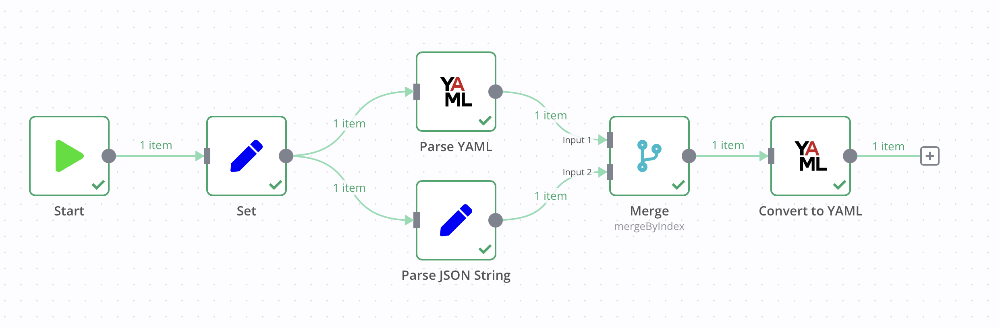

# n8n-nodes-yaml


This is an n8n community node for node for parsing and stringifying YAML.

[n8n](https://n8n.io/) is a [fair-code licensed](https://docs.n8n.io/reference/license/) workflow automation platform.

- [Installation](#installation)
  - [Community Nodes (Recommended)](#community-nodes-recommended)
  - [Manual installation](#manual-installation)
- [Operations](#operations)
- [Compatibility](#compatibility)
- [Example Workflow](#example-workflow)
- [Resources](#resources)
- [License](#license)

## Installation

Follow the [installation guide](https://docs.n8n.io/integrations/community-nodes/installation/) in the n8n community nodes documentation.

### Community Nodes (Recommended)

For users on n8n v0.187+, your instance owner can install this node from [Community Nodes](https://docs.n8n.io/integrations/community-nodes/installation/).

1. Go to **Settings > Community Nodes**.
2. Select **Install**.
3. Enter `n8n-nodes-yaml` in **Enter npm package name**.
4. Agree to the [risks](https://docs.n8n.io/integrations/community-nodes/risks/) of using community nodes: select **I understand the risks of installing unverified code from a public source**.
5. Select **Install**.

After installing the node, you can use it like any other node. n8n displays the node in search results in the **Nodes** panel.

### Manual installation

To get started install the package in your n8n root directory:

`npm install n8n-nodes-yaml`

For Docker-based deployments add the following line before the font installation command in your [n8n Dockerfile](https://github.com/n8n-io/n8n/blob/master/docker/images/n8n/Dockerfile):

`RUN cd /usr/local/lib/node_modules/n8n && npm install n8n-nodes-yaml`

## Operations

- **Operations**
  - **Parse**: Parse YAML text
    - `YAML`: The YAML string to parse
    - `Property Name`: The field to store the parsed output (default: `data`)
  - **Stringify**: Convert an item of field to a YAML string
    - `Value`: The object to convert to a YAML string
    - `Property Name`: The field to store the parsed output (default: `data`)

## Compatibility

n8n v0.187+

## Example Workflow



<details>
<summary>Expand to show workflow JSON</summary>

*Copy and paste this JSON into a blank n8n workflow!*

```json
{
  "nodes": [
    {
      "parameters": {
        "values": {
          "string": [
            {
              "name": "yaml",
              "value": "=---\n# <- yaml supports comments, json does not\n# did you know you can embed json in yaml?\n# try uncommenting the next line\n# { foo: 'bar' }\n\njson:\n  - rigid\n  - better for data interchange\nyaml: \n  - slim and flexible\n  - better for configuration\nobject:\n  key: value\n  array:\n    - null_value:\n    - boolean: true\n    - integer: 1\n    - alias: &example aliases are like variables\n    - alias: *example\nparagraph: >\n   Blank lines denote\n\n   paragraph breaks\ncontent: |-\n   Or we\n   can auto\n   convert line breaks\n   to save space\nalias: &foo\n  bar: baz\nalias_reuse: *foo"
            },
            {
              "name": "json",
              "value": "={\n  \"json\": [\n    \"rigid\",\n    \"better for data interchange\"\n  ],\n  \"yaml\": [\n    \"slim and flexible\",\n    \"better for configuration\"\n  ],\n  \"object\": {\n    \"key\": \"value\",\n    \"array\": [\n      {\n        \"null_value\": null\n      },\n      {\n        \"boolean\": true\n      },\n      {\n        \"integer\": 1\n      },\n      {\n        \"alias\": \"aliases are like variables\"\n      },\n      {\n        \"alias\": \"aliases are like variables\"\n      }\n    ]\n  },\n  \"paragraph\": \"Blank lines denote\\nparagraph breaks\\n\",\n  \"content\": \"Or we\\ncan auto\\nconvert line breaks\\nto save space\",\n  \"alias\": {\n    \"bar\": \"baz\"\n  },\n  \"alias_reuse\": {\n    \"bar\": \"baz\"\n  }\n}"
            }
          ]
        },
        "options": {}
      },
      "name": "Set",
      "type": "n8n-nodes-base.set",
      "typeVersion": 1,
      "position": [
        -380,
        0
      ],
      "id": "eac6fbf4-2af0-4af0-ad47-01799108c579"
    },
    {
      "parameters": {
        "values": {
          "string": [
            {
              "name": "JSON_DATA",
              "value": "={{ $json.json.parseJson() }}"
            }
          ]
        },
        "options": {}
      },
      "name": "Parse JSON String",
      "type": "n8n-nodes-base.set",
      "typeVersion": 1,
      "position": [
        -120,
        80
      ],
      "id": "a1bae44d-23f2-47c8-83c1-08e290f3c989"
    },
    {
      "parameters": {
        "mode": "mergeByIndex"
      },
      "name": "Merge",
      "type": "n8n-nodes-base.merge",
      "typeVersion": 1,
      "position": [
        120,
        0
      ],
      "id": "50b9891f-7b84-40c4-affb-1f2865a9697a"
    },
    {
      "parameters": {
        "value": "={{ $json[\"yaml\"] }}",
        "propertyName": "YAML_DATA"
      },
      "name": "Parse YAML",
      "type": "n8n-nodes-yaml.yaml",
      "typeVersion": 1,
      "position": [
        -120,
        -80
      ],
      "id": "b360ff9f-6442-4eae-a5c8-86da8efa6999"
    },
    {
      "parameters": {
        "operation": "stringify",
        "value": "={{ $json }}",
        "propertyName": "STRINGIFIED"
      },
      "name": "Convert to YAML",
      "type": "n8n-nodes-yaml.yaml",
      "typeVersion": 1,
      "position": [
        320,
        0
      ],
      "id": "0749fdde-808c-4fec-a0bf-59545712c308"
    },
    {
      "parameters": {},
      "type": "n8n-nodes-base.manualTrigger",
      "typeVersion": 1,
      "position": [
        -580,
        0
      ],
      "id": "cf2a6ef7-30fa-43f2-8f6e-035d87aac70e",
      "name": "When clicking ‘Test workflow’"
    }
  ],
  "connections": {
    "Set": {
      "main": [
        [
          {
            "node": "Parse YAML",
            "type": "main",
            "index": 0
          },
          {
            "node": "Parse JSON String",
            "type": "main",
            "index": 0
          }
        ]
      ]
    },
    "Parse JSON String": {
      "main": [
        [
          {
            "node": "Merge",
            "type": "main",
            "index": 1
          }
        ]
      ]
    },
    "Merge": {
      "main": [
        [
          {
            "node": "Convert to YAML",
            "type": "main",
            "index": 0
          }
        ]
      ]
    },
    "Parse YAML": {
      "main": [
        [
          {
            "node": "Merge",
            "type": "main",
            "index": 0
          }
        ]
      ]
    },
    "Convert to YAML": {
      "main": [
        []
      ]
    },
    "When clicking ‘Test workflow’": {
      "main": [
        [
          {
            "node": "Set",
            "type": "main",
            "index": 0
          }
        ]
      ]
    }
  }
}
```

</details>

## Resources

- [n8n community nodes documentation](https://docs.n8n.io/integrations/community-nodes/)

## License

[MIT](https://github.com/pemontto/n8n-nodes-yaml/blob/master/LICENSE.md)
